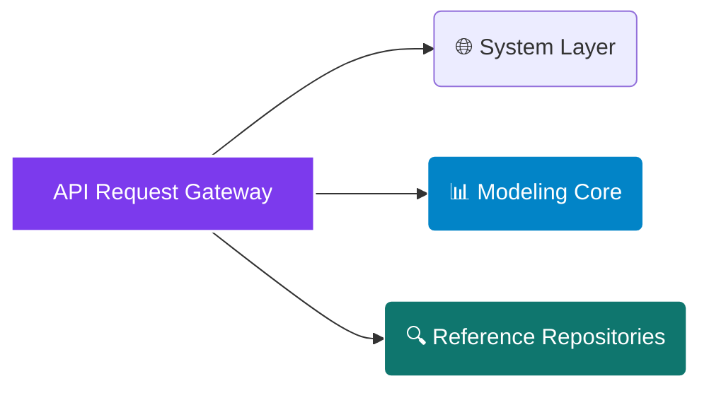

# <p align="center"></p>

<div align="center">

  <p><strong>Deterministic Solar and Electric Vehicle (EV) Joint Co-Sizing Engine, Time-of-Use (TOU) Arbitrage Optimization, and Vehicle-to-Home (V2H) Resiliency Valuation Framework</strong></p>

</div>

<div align="center">

  <a href="https://rapidapi.com/bethelnedi/api/solar-ev-integration-sizing-api"></a>
  <a href="https://elements.stoplight.io/viewer/?spec=https://raw.githubusercontent.com/bethelhash/Solar-EV-Integration-Sizing-API/refs/heads/main/openapi.json"></a>
  
  
  

</div>

---

## ⚡ Executive Summary

The **Solar + EV Integration Sizing API** is a specialized engineering microservice designed to simultaneously co-model residential photovoltaic generation alongside electric vehicle charging profiles. Standard calculators routinely evaluate these variables in complete isolation, yielding severely undersized solar layouts or skewed financial payback profiles. This engine mathematically fuses both energy vectors into an integrated balance of system.

By matching localized **PVWatts V8 physics engines** with fuel economy efficiency data from **EPA datasets**, this architecture maps out exact charging consumption blocks alongside home baselines. It optimizes vehicle charging behavior against localized Time-of-Use (TOU) pricing structures and NEM 3.0 export limitations, while screening Vehicle-to-Home (V2H) emergency backup capabilities in **under 480ms**.

<blockquote align="left">

  <strong>💎 AUDIT-READY CO-MODELING LOGIC</strong><br>

  Engineered to pass strict pre-feasibility analysis and automotive cross-selling due diligence, this platform eliminates anecdotal approximations. Whether calculating vehicle charging conversion losses under DOE parameters or tracking peak-period load shifting via state public utility tariffs, every metric traces back to established legislative frameworks or peer-reviewed literature.

</blockquote>

---

## 🏛️ Enterprise Core Capabilities

<table width="100%">
  <tr>
    <td width="50%" valign="top">
      <h3>📈 Dynamic Unified Sizing Core</h3>
      <ul>
        <li><strong>Simultaneous Demand Integration:</strong> Combines static household utility consumption with active fleet mileage profiles to prevent future localized grid dependencies.</li>
        <li><strong>Empirical EV Consumption Mapping:</strong> Ingests specific electrical consumption weights across 17 premium consumer vehicles (Tesla, Ford, Rivian, Lucid) including charging thermal losses.</li>
        <li><strong>Incremental Infrastructure Sizing:</strong> Isolates the exact supplementary panel count, square footage footprint, and balance-of-system cost required exclusively to power the EV.</li>
      </ul>
    </td>
    <td width="50%" valign="top">
      <h3>🔌 Grid Arbitrage &amp; Resiliency</h3>
      <ul>
        <li><strong>TOU Tariff Dispatch Optimization:</strong> Simulates cost behaviors across flat, optimized off-peak scheduling, and direct solar-to-vehicle self-charging streams.</li>
        <li><strong>V2H Microgrid Analysis:</strong> Evaluates onboard heavy battery storage thresholds (e.g., Ford Lightning, Rivian R1T) to outline local circuit backup runtime horizons.</li>
        <li><strong>NEM 3.0-Aware Battery Recommender:</strong> Provides intelligent energy storage advice aligned with strict California avoided-cost export regimes.</li>
      </ul>
    </td>
  </tr>
</table>

---

## 🗺️ Market Architecture Hub

### 🌍 Physical Meteorological & Grid Controls
The integration core syncs regional solar insulation properties with local network policy controls using simple spatial criteria:
`US ZIP Code Resolution` &middot; `State PUC TOU Rate Profiles` &middot; `Regional NEM Policy Maps`

### 📊 Modeled Fleet Configurations
Vehicle efficiency variables are updated dynamically against standard manufacturer chassis specifications:
`Tesla Model Y/3` &middot; `Ford F-150 Lightning` &middot; `Rivian R1T` &middot; `Chevy Equinox/Bolt` &middot; `Hyundai Ioniq 6` &middot; `Lucid Air` &middot; `Custom Profiles`

---

## 📂 API Core Endpoint Directory



---

### 🌐 System Layer

* `GET /health` — Validates microservice execution depth, returning live operational status metrics and database vehicle capacities.
* `GET /pricing` — Returns active platform tier restrictions, execution rate limits, and product feature inclusions.

### 📊 Modeling Core

* `POST /size/quick` — Preliminary system optimization node. Processes basic geographic markers, vehicle IDs, annual driving distances, and pre-EV electric balances to yield home vs. combined array sizes, auxiliary panel splits, and alternative charging cost tiers. *(Free Tier)*
* `POST /size/full` — Institutional microgrid asset design suite. Ingests dual-EV asset combinations, variable project installation horizons, continuous investment discount rates, and daytime charging allocation choices to construct 25-year localized net cash flow schedules, complete NPV/IRR records, and exhaustive V2H backup metrics. *(Pro Tier)*

### 🔍 Reference Repositories

* `GET /reference/ev-models` — Streams complete performance arrays, baseline pack limits, and V2H capacity markers for all 17 supported EV variants.
* `GET /reference/tou-rates/{state}` — Exposes specific time-of-use pricing parameters, peak block schedules, and active utility sources by state.
* `GET /reference/v2h-vehicles` — Limits results to active vehicle-to-home and bidirectional vehicle-to-grid ready models.
* `GET /reference/sizing-methodology` — Exposes full underlying mathematical logic loops, physical assumptions, and programmatic engineering references.

---

## 📈 Engineering Methodology & Verification Matrix

The application tier establishes professional transparency by tying all integrated operations to official government data sheets and municipal legal codes:

| Calculation Block | Governing Code / Framework | Primary Empirical / Reference Source Citation |
| --- | --- | --- |
| **Solar Generation Array** | PVWatts V8 System Engine | Dobos (2014) NREL Technical Reference Manual: NREL/TP-6A20-62641 |
| **EV Consumption Targets** | Electric Vehicle Fuel Metrics | EPA Fuel Economy Datasets & Fleet Efficiency Portals (2024 Reference) |
| **Retail Tariff Baselines** | Annual Utility Rate Schedules | US Energy Information Administration (EIA) Form 861 Electricity Ledger |
| **TOU Cost Distribution** | Public Utility Commission Filings | State-specific Rate Ledgers (e.g., SCE TOU-D-PRIME / PG&E EV2-A) |
| **Net Metering Limits** | Regional Interconnection Rules | Database of State Incentives for Renewables & Efficiency (DSIRE 2024) |
| **Bidirectional Specs** | V2H Energy Discharge Bounds | Manufacturer Engineering Documentation (Ford, Nissan, Rivian Core) |
| **Charging Power Loss** | Vehicle Conversion Efficiencies | DOE Alternative Fuels Data Center (AFDC) Charging Loss Matrices |
| **Combined System ROI** | Co-Sizing Investment Metrics | NREL Integrated Solar+EV Fleet Optimization & Infrastructure Studies |
| **Continuous Asset Decay** | Year-Over-Year Yield Decline | Jordan & Kurtz (2013) Photovoltaic Degradation Rates, *Progress in PV* |

---

## 🚀 Quickstart Integration Example (Python)

To run an integrated co-sizing analysis for a multi-vehicle residential system asset configuration, employ the integration blueprint below:

```python
import json
import requests

# Core Routing Configuration via RapidAPI Gateway
GATEWAY_URL = "[https://solar-ev-integration-sizing-api.p.rapidapi.com/size/full](https://solar-ev-integration-sizing-api.p.rapidapi.com/size/full)"

payload = {
    "zip_code": "94102",
    "monthly_bill_usd": 320,
    "ev_id": "tesla_model_y_rwd",
    "annual_miles": 12000,
    "second_ev_id": "ford_f150_lightning_std",
    "second_ev_miles": 15000,
    "roof_orientation": "south",
    "shading": "minimal_trees",
    "daytime_charging": True,
    "install_year": 2026,
    "discount_rate": 0.06
}

headers = {
    "Content-Type": "application/json",
    "X-API-Key": "YOUR_SECURE_MARKETPLACE_TOKEN",
    "X-RapidAPI-Host": "solar-ev-integration-sizing-api.p.rapidapi.com"
}

response = requests.post(GATEWAY_URL, json=payload, headers=headers)
print(json.dumps(response.json(), indent=2))

```

---

## 💎 Production Access Tiers

| Tier Classification | Monthly Access Fees | Active Rate Latency Caps | Inclusive Data Volume Quota | Programmatic Endpoint Access | Support Service Level |
| --- | --- | --- | --- | --- | --- |
| **Free Tier Core** | $0 / Month | 5 Requests / Minute | Regional Sandbox Boundaries | `/size/quick` + Reference Hub | Open Community Forum |
| **Pro Enterprise** | $49 / Month | 1,000 Requests / Hour | Unlimited Volume Quota | Complete `/size/full` Deep Pipeline | Standard Service SLA |
| **Ultra Bundle Hub** | $149 / Month | 1,000 Requests / Hour | Unlimited Volume Quota | Complete Infrastructure Suite Access | Dedicated Operations SLA |

* **Platform Tool Access & Sandboxes:** Pro and Ultra tiers grant automatic key validation on the [SolarWatch / SolarTruth Web Interface Ecosystem (solar-ev-advisor.vercel.app)](https://www.google.com/search?q=https://solar-ev-advisor.vercel.app/) upon platform launch. Active tokens populate interactive TOU charging schedules, localized grid displacement modeling blocks, and detailed client proposals.
* **White-Label Integration Deployment:** Ultra tier subscribers gain structural rights to remove native branding metrics and frame the interactive design framework directly on corporate engineering domains or manufacturer client web spaces (subject to a 1-day deployment domain validation).

---

## 🔒 Proprietary License & Terms

### Intellectual Property Protection

**Copyright © 2026 Axiom Infrastructure Intelligence LLP. All rights reserved.**

The Solar + EV Integration Sizing API, its integrated dispatch simulation algorithms, structural co-sizing logic blocks, bidirectional discharge estimation matrices, proprietary endpoints, and data schemas are the exclusive proprietary intellectual property of Axiom Infrastructure Intelligence LLP. No part of this interface map, processing logic, or endpoint schema may be duplicated, reverse-engineered, white-labeled, or redistributed without an executed Master Services Agreement (MSA) and express written licensing permission from the corporate rights holder.

### Technical Disclaimer

All vehicle range estimates, backup durations, utility calculations, and joint sizing models generated by this API are engineered as specialized pre-feasibility analysis indicators. Real-world microgrid operations remain contingent on specific vehicular software configurations, localized circuit wiring updates, continuous temperature environments, and home panel transfer switch mechanics.

```

```
